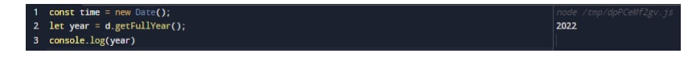
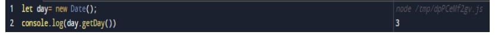

#  _DATA-and-TIME_
#### Дар ин презентатсия шумо бо ёрии мисолҳо дар бораи сана ва вақт дар JavaScript маълумот хоҳед гирифт
 ##### Дар JavaScript сана ва вақт бо объекти Date муаррифӣ мешавад. Объекти Date маълумоти сана ва вақтро пешниҳод мекунад ва инчунин усулҳои гуногунро пешниҳод мекунад. Санаи JavaScript давраи EcmaScript-ро муайян мекунад, ки миллисонияҳоро ифода мекунад аз 1 январи соли 1970 UTC. Ин сана ва вақт ба давраи UNIX баробар аст (арзиши бартаридошта барои арзишҳои сана ва вақт, ки аз ҷониби компютер сабт шудааст)
 # Эҷоди объектҳои сана
 #### -Чор роҳи сохтани объекти сана вуҷуд дорад-
 ## 1-•new Date()
 ## 2-•new Date(milliseconds)
 ## 3-•new Date(Date string)
 ## 4-•new Date(year, month, day, hours, minutes, seconds, milliseconds)

#               (1-new Date())
## Шумо метавонед объекти санаро бо истифода аз созандаи нави Date() созед. Масалан

#                 (2-new Date(milliseconds)
## Объекти Date дорои ададест, ки миллисонияҳоро ифода мекунадаз 1 январи соли 1970 UTC. Санаи нав(миллисония) Эҷод мекунад aобъекти нави Сана бо илова кардани миллисекундҳо ба вақти сифр. Барои мисол

#                 (3-new Date(new Date (date string)
### Санаи нав - (сатри сана) объекти санаи навро аз сатри сана эҷод мекунад. Дар JavaScript, дар он ҷоодатан се формати вуруди сана мебошанд. Форматҳои санаи ISO Шумо метавонед объекти санаро тавассути Гузаронидани форматҳои санаи ISO. Барои намуна

#  (new Date (year, month, day, hours, minutes, seconds, milliseconds)
### Санаи нав (сол, моҳ, рӯз, соат, дақиқа, сония, миллисония) нав Сана(сол, моҳ,...) объекти санаи навро бо санаи муайян мекунад ва вақт. барои намуна,

###  Эзоҳ: Агар шумо танҳо як аргументро гузаронед, он ҳамчун миллисония ҳисоб карда мешавад. Аз ин рӯ, барои истифодаи ин формати сана, шумо бояд ду далелро гузаронед. Дар JavaScript, моҳ аз ҳисоб 0 ба 11. Январ аст 0 ва 11 декабрь.

### Methods (in JS)
## 1-Method now
### Date.now() returns the number of milliseconds since January 1, 1970.

## 2-getFullYear()
### getFullYear() returns the full year of a date (4 digits).

## 3-getMonth()
### getMonth() returns the month (0 to 11) of the date. January = 0, February = 1, ..

## 4-getDate()
### The getDate() method returns the day of the month (1 to 31) of the date.

## 5-getDay()
### The getDay() method returns the day of the week (0 to 6) of the date. Sunday = 0, Monday = 1,

## 6-getHours()
### getHours() returns the hours (0 to 23) of a date

## 7-getMinutes
### getMinutes() returns the minutes (0 to 59) of a date.

## setFullYear()
### setFullYear() sets the year of the date. setFullYear() can also set the month and day

